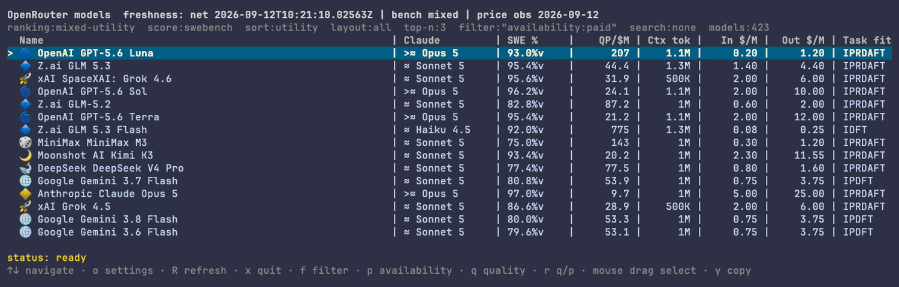

# openrouter-model-tracker

CLI/TUI для сравнения AI-моделей на OpenRouter по качеству и цене.

`openrouter-model-tracker` собирает живой каталог моделей OpenRouter (цены,
контекст) и сопоставляет его с независимыми оценками качества — SWE-bench
Verified (vals.ai и swebench.com) и LMArena Elo, — затем ранжирует платные
модели по метрике «качество/цена» и раскладывает их по тирам, ориентированным
на Claude Opus/Sonnet/Haiku. Сопоставление строк с разных сайтов проходит через
ручную карту `model-map.tsv` и structured identity gate, а не fuzzy-match по
имени: нет записи в карте — нет оценки. Данные доступны и в интерактивном TUI,
и как plain-text CLI-таблица, и как готовый Markdown-отчёт.

## Скриншоты

Короткий тур по TUI: главный экран с ранжированной таблицей → переключение
источника оценки (`Space`, SWE-bench/Arena) → карточка модели → переключение
фильтра доступности (`p`, paid/free) на бесплатные модели — без выхода из
приложения:



## Возможности

- Три независимых источника данных: цены и контекст — из публичного
  OpenRouter API; качество — SWE-bench Verified (vals.ai, swebench.com) и
  LMArena Elo, независимая оценка отдельно от вендорской.
- Ранжирование платных моделей по метрике «качество/цена» (mixed-utility) с
  тирами относительно Claude Opus/Sonnet/Haiku; настраиваемая ranking-формула.
- Интерактивный TUI (`openrouter tui`): сортировка, structured-фильтры,
  детальная карточка модели, переключение источника оценки (SWE-bench/Arena) и
  доступности (paid/free) прямо в интерфейсе.
- Тот же движок как plain-text CLI-таблица (`openrouter table`) — без сети, для
  скриптов и пайпов.
- Настраиваемые фильтры, ranking-формула, иконки производителей, хоткеи и шаги
  редактора фильтра — всё через пользовательский `config.yaml`, без пересборки.
- История цен (`openrouter history`) и отчёт об изменениях каталога (`openrouter
  check`) поверх того же локального снимка.

## Методология

Каждая строка таблицы собрана из трёх независимых источников: живая цена и
контекст из каталога OpenRouter, независимый benchmark score (SWE-bench
Verified с vals.ai/swebench.com или LMArena Elo — никогда оба сразу) и
ручной Claude-relative tier. Строка с лидерборда попадает в оценку модели
только через явное сопоставление в `model-map.tsv` — никогда по похожести
имён, — а платные модели ранжируются по «качество/цена» с настраиваемой
value-формулой. Полное описание identity-gate, трёх измерений качества и
формулы ранжирования — в [docs/methodology.md](docs/methodology.md).

## Установка

Для macOS и Linux — публичный Homebrew tap:

```bash
brew install MikcleGrok/openrouter/openrouter-model-tracker
```

Ставит бинарник `openrouter-model-tracker` и короткий алиас `omt` — это один и
тот же бинарник под двумя именами. Обновление до новой версии:

```bash
brew upgrade MikcleGrok/openrouter/openrouter-model-tracker
```

Без Homebrew, или на других платформах, — штатная локальная установка через
Makefile (нужен Go 1.26.5 или новее, см. `go.mod`):

```bash
git clone https://github.com/MikcleGrok/openrouter-model-tracker.git
cd openrouter-model-tracker
make install
```

По умолчанию бинарник устанавливается как `/usr/local/bin/openrouter`. Каталог
можно изменить без username-specific путей: `PREFIX` задаёт корень, а при
отсутствии явного `BINDIR` используется `$PREFIX/bin`. Явный абсолютный
`BINDIR` является самостоятельным target и может находиться вне `PREFIX`.
`VERSION` по
умолчанию равен точной версии tag checkout или `0.0.0-dev` для checkout без
exact tag; при явном `VERSION` это значение внедряется в бинарник и полностью
проверяется до атомарной замены. `TARGET` позволяет выбрать Go package для сборки.

```bash
make install PREFIX="$HOME/.local" BINDIR="$HOME/.local/bin"
make upgrade PREFIX="$HOME/.local" VERSION=1.15.0
make reinstall PREFIX="$HOME/.local"
make uninstall PREFIX="$HOME/.local"
make install-smoke
```

`install`, `upgrade` и `reinstall` собирают бинарник во временный каталог и пишут
только в installation target; временные файлы удаляются после завершения. `PREFIX` и
конечный `BINDIR` обязательны, непусты и должны быть абсолютными; явный `BINDIR`
независим от `PREFIX` и может находиться вне него. На один `BINDIR` берётся bounded
lock, поэтому параллельные установки сериализуются, а ожидание завершается ошибкой
через 60 секунд. Все проверки source/version/help/target/path выполняются до замены.
После preflight binary заменяется атомарно, а sidecar marker обновляется отдельно под lock с rollback при ошибке, где это возможно; installer
`$(BINDIR)/openrouter.openrouter-owner` имеет mode 600 и содержит identifier, точный destination
и версию. `uninstall` удаляет binary только при валидном marker с совпадающим destination;
отсутствующий marker оставляет файл и возвращает WARN с exit 0, невалидный marker оставляет
оба объекта и возвращает ошибку.
Все компоненты destination проверяются на symlink traversal по canonical path.
На exact tag грязный checkout с release `VERSION` отклоняется, чтобы изменённый
исходный код не выдавался за release.
`uninstall` никогда не удаляет немаркированный или Homebrew-managed файл
`$(BINDIR)/openrouter`. `install-smoke` использует
временный PREFIX, проверяет `--version`, `version` и `--help`, и не изменяет
системную установку. Homebrew остаётся отдельным внешним каналом: `make
verify-release` и `make homebrew-reinstall` проверяют локальный disposable tap,
но local installer от Homebrew не зависит. Symlink rejection является best-effort:
lock с уникальным owner token уменьшает concurrent race; cleanup удаляет lock только при
совпадении token, но shell-проверки TOCTOU не защищают от злонамеренной
замены каталога между проверкой и операцией.

После клонирования полезно выполнить `make install-hooks` — это включает pre-commit
проверку, которая блокирует коммит приватных ключей и credentials в отслеживаемых файлах.

## Документация

Локальная разработка, полный список команд, Makefile-таргеты, релиз-процесс и файлы, которые правятся руками, — в [docs/reference.md](docs/reference.md).
