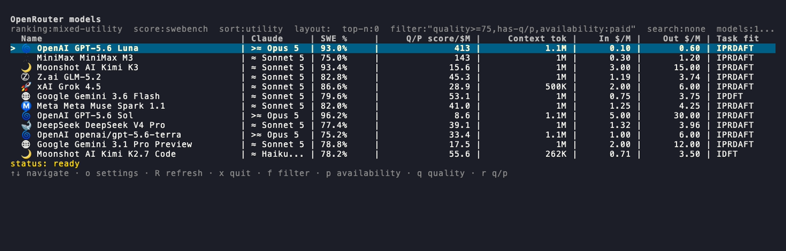
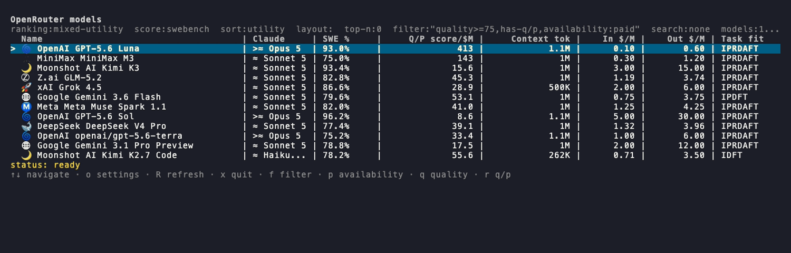

# openrouter-model-tracker

CLI/TUI для сравнения AI-моделей на OpenRouter по качеству и цене.

`openrouter-model-tracker` собирает живой каталог моделей OpenRouter (цены,
контекст) и сопоставляет его с независимыми оценками качества — SWE-bench
Verified (vals.ai и swebench.com) и LMArena Elo, — затем ранжирует платные
модели по метрике «качество/цена» и раскладывает их по тирам, ориентированным
на Claude Opus/Sonnet/Haiku. Сопоставление строк с разных сайтов проходит через
ручную карту `model-map.tsv` и structured identity gate, а не fuzzy-match по
имени: нет записи в карте — нет оценки. Данные доступны и в интерактивном TUI,
и как plain-text CLI-таблица, и как готовый Markdown-отчёт.

## Скриншоты

Главный экран TUI — ранжированная таблица с тирами Claude, метрикой
«качество/цена» и иконками производителей:



Карточка модели и переключение фильтра доступности (`p`, paid/free) без выхода
из приложения:



## Возможности

- Три независимых источника данных: цены и контекст — из публичного
  OpenRouter API; качество — SWE-bench Verified (vals.ai, swebench.com) и
  LMArena Elo, независимая оценка отдельно от вендорской.
- Ранжирование платных моделей по метрике «качество/цена» (mixed-utility) с
  тирами относительно Claude Opus/Sonnet/Haiku; настраиваемая ranking-формула.
- Интерактивный TUI (`openrouter tui`): сортировка, structured-фильтры,
  детальная карточка модели, переключение источника оценки (SWE-bench/Arena) и
  доступности (paid/free) прямо в интерфейсе.
- Тот же движок как plain-text CLI-таблица (`openrouter table`) — без сети, для
  скриптов и пайпов.
- Настраиваемые фильтры, ranking-формула, иконки производителей, хоткеи и шаги
  редактора фильтра — всё через пользовательский `config.yaml`, без пересборки.
- История цен (`openrouter history`) и отчёт об изменениях каталога (`openrouter
  check`) поверх того же локального снимка.

## Установка

Для macOS и Linux — публичный Homebrew tap:

```bash
brew install MikcleGrok/openrouter/openrouter-model-tracker
```

Ставит бинарник `openrouter-model-tracker` и короткий алиас `omt` — это один и
тот же бинарник под двумя именами. Обновление до новой версии:

```bash
brew upgrade MikcleGrok/openrouter/openrouter-model-tracker
```

Без Homebrew, или на других платформах, — сборка из исходников (нужен Go
1.26.5 или новее, см. `go.mod`):

```bash
git clone https://github.com/MikcleGrok/openrouter-model-tracker.git
cd openrouter-model-tracker
go build -o bin/openrouter ./cmd/openrouter
```

## Документация

Локальная разработка, полный список команд, Makefile-таргеты, релиз-процесс и файлы, которые правятся руками, — в [docs/reference.md](docs/reference.md).
